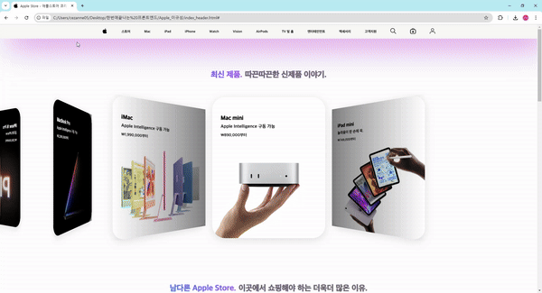

# 애플 웹 페이지 리뉴얼


## 1. Team Members (팀원 및 팀 소개 및 역할 분담) 


|이규성|김민정|신효진|권소정|
|------|-----|------|------|
|FE|FE|FE|FE|
|[GitHub](https://github.com/2gyusung)|[GitHub](https://github.com/2gyusung)|[GitHub](https://github.com/2gyusung)|[GitHub](https://github.com/2gyusung)|
|테스트1|테스트2|테스트3|테스트3|

## 이규성

* `UI`
    - 애플스토어 신제품  : 홈, 검색, 게시글 작성, 게시글 수정, 게시글 상세, 채팅방
    - 쇼핑 해야 하는 이유 : 버튼 디자인 변경 및 hover css 활용 
- `기능`
    - swiper.js 활용해서 똑같이 구현하며 레이아웃 구성
    - 헤더 그라이언트 애니메이션 활용하여 신제품 아이폰 색상을 표현하여 구성
  
* `기획`
    - 문서 MD 파일 작성
  

## 김민정
* `UI`
    -  header :  header 디자인 수정 및 flex를 활용 하여 구현 
    -  nav  : 상품목록 애플 스토어 페이지 디자인 수정 후 레이아웃은 똑같이 구현 
    -  레이아웃 디자인
- `기능`
    - 프로필 설정 및 수정 페이지 유저 아이디 유효성 및 중복 검사, 상품 등록 및 수정

 * `기획`
    - 문서 MD 파일 작성

## 신효진
* `UI`
    - 애플 경험  : 애플 경험  레이아웃와 swiper.js을 활용해 똑같이 구현
    - footer   : 애플 스토어 footer 레이아웃 똑같이 구현
    -  레이아웃 디자인
- `기능`
   - swiper.js 활용해서 똑같이 구현하며 레이아웃 구성

## 권소정
* `기획`
    - 문서 작성 및 디자인 구성


##  제안 배경 및 필요성💡

1. `애플스토어 구매 권장`
   - 필요성 강조: 애플스토어만의 차별성 및 구매 필요성을 메인 페이지 첫 줄에 명확하게 전달.
   - Apple 제품 구매의 차별성 강조: 애플의 독특한 제품 경험과 서비스를 강조하여 방문자가 애플스토어에서 쇼핑할 이유를 명확히 알 수 있도록 함.
   - Apple Music 혜택 강조: 이어폰 구매 시 제공되는 3개월 무료 Apple Music 혜택도 메인 페이지에 강조하여 추가 구매 유도.

2. `도움의 손길, 액세서리, 생생하게 들리는 차이`
   - 메인 페이지에서 제거: 이미 상단 메뉴에 포함된 항목이므로, 사용자가 제품에 집중할 수 있도록 해당 항목들을 메인 페이지에서 제외.
   - 제품 강조: 애플의 주력 제품들을 더욱 강조하여 방문자가 제품에 집중할 수 있도록 유도.

3. `Apple 경험`
   - 편리한 사용법 강조: 애플의 사용법 및 기능을 통해 제품 구매를 촉진할 수 있는 __Apple 경험__ 섹션은 최신 제품 밑에 배치하여, 구매자들이 편리한 사용법을 알 수 있도록 유도.

4. `상단 메뉴 개선`
   - 호버 하이라이터 추가: 상단 메뉴에 마우스를 올릴 때, 메인 메뉴가 변경되었음을 명확히 알리기 위해 하이라이트 효과를 추가.
   - 서브 메뉴 명확화: 서브 메뉴가 변경되었을 때, 메인 메뉴의 변화가 확실하게 드러날 수 있도록 하이라이트 효과를 강화.
   - 헤더 그라이언트 추가 : 메뉴 그라이언트 애니메이션을 활용하여 신제품 아이폰 색상을 표현하며 강조.

5. `애플 사용자 로그인 편의성 개선`
      - 로그인 아이콘 추가: 장바구니 옆에 로그인 아이콘을 추가하여 사용자가 쉽게 로그인할 수 있도록 개선, 로그인 후 구매 과정이 더욱 원활하게 진행되도록 유도.

6. `특별 할인 홍보 방식`
   - 팝업창 활용: 특별 할인 등 강조할 이벤트는 팝업창이나 모달 팝업으로 띄워서 눈에 띄게 강조. 이를 통해 방문자들이 이벤트에 쉽게 접근할 수 있도록 유도.
  
7. `scroll to the top 버튼 활용`
    - 버튼 활용 : 버튼을 활용하여 UI 사용자가 쉽게 접근할 수도록 접근하여 이용할 수 있도록  유도

> 위 사항들을 반영하면 사용자의 쇼핑 경험이 더 직관적이고 효율적으로 개선될 수 있을 것입니다.

##  Technology Stack (기술 스택) 📚


  

##  Project Structure (프로젝트 구조) 📁
```
project/
├── index.html               # HTML 템플릿 파일
│      
│   
├── src/
│   ├── assets/              # 이미지, 폰트 등 정적 파일
│   ├── images               # 이미지 폴더
│   ├── main.js              # 메인 애플리케이션 컴포넌트
│   ├── swiper.js            # swiper 구현
│   └── index.css            # 전역 css 파일
│        
│  
├── .gitignore               # Git 무시 파일 목록
└── README.md                # 프로젝트 개요 및 사용법
```

##  개발 기간 및 작업 관리 📆
- __전체 개발 기간__ : 2024-11-08 ~ 2024-12-06
- __기획서 작성 기간__ : 2024-11-04 ~ 2024-11-08
- __UI 구현__ : 2024-11-09 ~ 2024-11-18 (HTML CSS 완성 뼈대만) 
- __기능 구현__ : 2024-11-19 ~ 2024-12-02 JS , 제이쿼리 구현
- __중간 점검__ : 2024-11-18(HTML 점검 + md 정리) , 2024-12-02(기능 점검)


##  신경쓴 부분 📋
- width 1280px 으로 진행
- 협업 하며 부족한 부분 서로에게 피드백을 주며 완성 시킬 것
- 애플 스토어 페이지를 통해 레이아웃 구조를 따라 만들며 부분적인 디자인이나 변경 하여 
  완성 시킬 것
- CSS flex 구조와 hover를 통해 디자인 부분을 완성 시킬 것
- swiper.js 라이브러리를 통해 swiper 활용 할 것
- favicon 를 사용하여 타이틀 아이콘 생생
  

## 애플 웹사이트 Before


## 애플 웹사이트 After


## 애플 웹사이트 반응형 After

